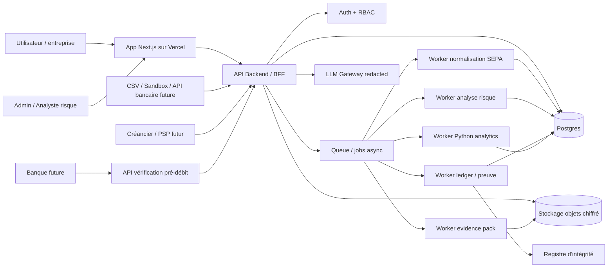
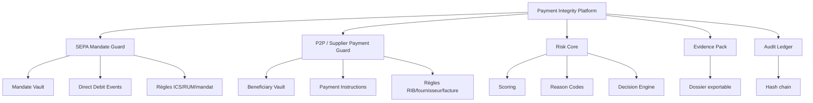
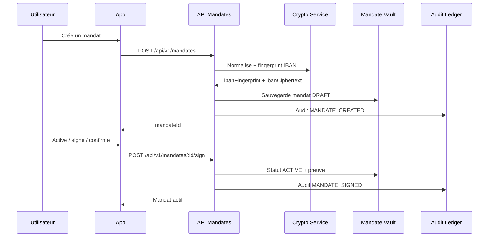
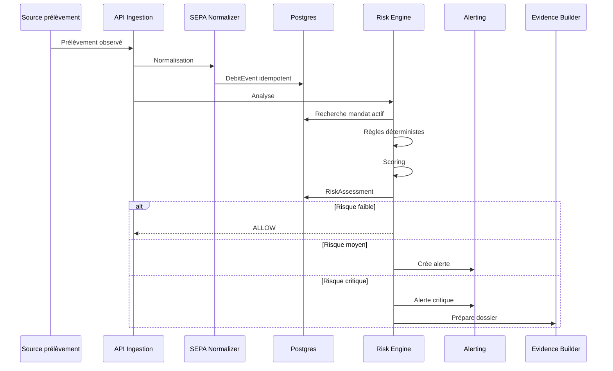
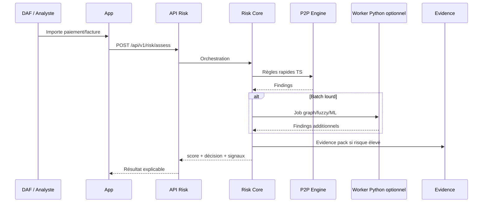
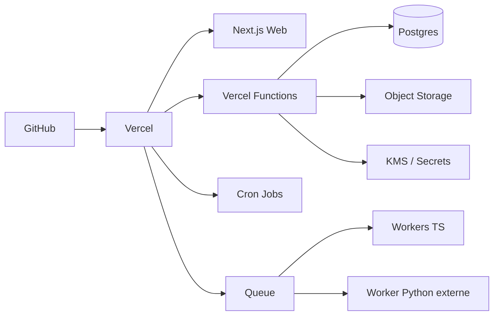

---

# FILE: README.md

# MandateGuard / Payment Integrity Platform — Dossier Claude Code

Ce dossier contient une spécification Markdown découpée pour construire une plateforme de sécurité des flux bancaires.

Le produit est organisé en deux modules complémentaires :

1. **SEPA Mandate Guard** : coffre-fort de mandats SEPA, analyse des prélèvements entrants, détection d’anomalies ICS/RUM/IBAN, révocation, dossier de contestation.
2. **P2P / Supplier Payment Guard** : analyse des paiements sortants, changements de RIB fournisseur, nouveaux bénéficiaires, doublons, sous-seuils, graphes de fraude, evidence pack.

Le cœur commun s’appelle **Risk Core** : règles explicables, reason codes, scoring, décisions, evidence pack et audit ledger.

## Comment utiliser ce dossier avec Claude Code

Copier ces fichiers à la racine du dépôt, puis demander à Claude Code de lire dans cet ordre :

1. `CLAUDE.md`
2. `docs/00_MANIFEST.md`
3. `docs/01_PRODUCT_SCOPE.md`
4. `docs/02_ARCHITECTURE_VISUELLE.md`
5. `docs/03_ARCHITECTURE_CODE.md`
6. `docs/15_ROADMAP_BACKLOG.md`
7. `docs/16_PROMPTS_CLAUDE_CODEX.md`

Ensuite, travailler par sprint en utilisant les tâches de `backlog/`.

## Objectif technique

Stack cible :

- Next.js App Router
- TypeScript strict
- pnpm workspaces
- Prisma + Postgres
- Zod
- Vitest + Playwright
- Vercel pour web, API, crons et orchestration
- Worker Python optionnel pour analytics batch lourdes : pandas, scikit-learn, NetworkX

## Non-objectifs du MVP

Le MVP ne doit pas :

- initier des paiements ;
- se présenter comme une banque ;
- bloquer réellement des prélèvements sans intégration PSP/banque ;
- stocker d’IBAN en clair ;
- envoyer de données personnelles non masquées à un LLM ;
- utiliser une blockchain publique contenant des données personnelles.

## Résultat attendu du MVP

Un produit web permettant de :

- créer et révoquer des mandats SEPA ;
- importer des prélèvements ;
- analyser chaque événement avec un score explicable ;
- créer des alertes ;
- générer un dossier de contestation ;
- conserver une piste d’audit vérifiable ;
- tester des scénarios dans un Risk Lab.


---

# FILE: CLAUDE.md

# Instructions pour Claude Code — MandateGuard

Tu travailles sur **MandateGuard**, une plateforme de sécurité des flux bancaires. Le MVP est un outil d’analyse, d’archivage, de détection, de preuve et d’assistance. Il ne doit pas initier de paiement.

## Règles non négociables

- Ne jamais logger d’IBAN complet, de nom complet, de PDF mandat, de signature, de payload bancaire brut ou de document sensible.
- Utiliser des fingerprints HMAC pour rechercher les IBAN.
- Chiffrer tous les champs sensibles au repos.
- Ne jamais mettre de données personnelles dans le ledger ou dans une blockchain.
- Les décisions de risque doivent être explicables et basées d’abord sur des règles déterministes.
- Les LLM peuvent expliquer, classifier ou rédiger, mais ne doivent jamais être le seul décideur de fraude.
- Toute entrée API doit être validée avec Zod.
- Toute règle de risque doit avoir des tests unitaires.
- Tout endpoint d’ingestion doit être idempotent.
- Toute action sensible doit créer un `AuditEvent`.
- Toutes les requêtes multi-tenant doivent vérifier explicitement `tenantId`.
- Les webhooks doivent être signés et protégés contre le replay.
- Les clés API doivent être hashées au repos.

## Architecture attendue

- App web dans `apps/web`.
- Logique métier dans `packages/`.
- Pas de logique métier lourde directement dans les route handlers.
- Prisma pour la persistance.
- Zod pour les schémas d’entrée/sortie.
- `packages/risk-core` ne doit pas dépendre de Next.js.
- `packages/sepa-sdd` contient les règles liées aux prélèvements SEPA.
- `packages/p2p-integrity` contient les règles liées aux paiements sortants/fournisseurs.
- `packages/evidence` construit les dossiers de preuve.
- `packages/ledger` gère l’audit log append-only et vérifiable.
- `packages/ai` masque les données avant toute utilisation LLM.

## Commandes qualité à exécuter avant de considérer une tâche terminée

```bash
pnpm typecheck
pnpm lint
pnpm test
```

Si des tests E2E existent pour le flux touché :

```bash
pnpm test:e2e
```

## Style de code

- TypeScript strict.
- Petites fonctions testables.
- Types explicites pour les objets de domaine.
- Erreurs métier nommées.
- Pas d’`any` sauf justification dans un commentaire.
- Pas de secrets codés en dur.
- Pas de données réelles dans les fixtures.

## Définition of Done

Une tâche est terminée seulement si :

1. Le code compile.
2. Les tests passent.
3. Les chemins d’erreur sont gérés.
4. Les données sensibles sont masquées ou chiffrées.
5. Les actions sensibles sont auditées.
6. La documentation touchée est mise à jour.


---

# FILE: AGENTS.md

# Agent Instructions

Ce fichier sert aux agents de code compatibles avec les instructions de dépôt.

## Product summary

MandateGuard is a Payment Integrity Platform composed of:

- SEPA Direct Debit mandate vault and risk engine.
- Supplier/payment integrity risk engine.
- Shared risk core, evidence pack builder and audit ledger.

## Hard constraints

- Do not implement payment initiation in the MVP.
- Do not store full IBANs in plain text.
- Do not log PII.
- Use HMAC fingerprints for IBAN lookup.
- Use encrypted storage for sensitive fields and documents.
- Keep LLMs out of final fraud decision-making.
- Keep risk decisions explainable.
- Every detection rule requires unit tests.
- Every API endpoint requires Zod validation.
- Respect tenant isolation.

## Preferred implementation order

1. Workspace and packages.
2. Prisma schema.
3. Crypto helpers.
4. Mandate vault.
5. Risk core.
6. SEPA rules.
7. P2P rules.
8. Evidence pack.
9. Audit ledger.
10. UI screens.
11. Deployment configuration.


---

# FILE: docs/00_MANIFEST.md

# Manifest des documents

## Fichiers racine

- `README.md` : vue d’ensemble du dossier.
- `CLAUDE.md` : instructions principales pour Claude Code.
- `AGENTS.md` : instructions génériques pour agents de code.

## Spécifications produit et architecture

- `docs/01_PRODUCT_SCOPE.md` : périmètre produit, modules, MVP, non-objectifs.
- `docs/02_ARCHITECTURE_VISUELLE.md` : diagrammes Mermaid.
- `docs/03_ARCHITECTURE_CODE.md` : architecture du monorepo, packages, responsabilités.
- `docs/04_DATA_MODEL_PRISMA.md` : modèle de données cible Prisma.
- `docs/05_API_CONTRACTS.md` : endpoints et contrats JSON.
- `docs/06_RISK_ENGINE.md` : moteur d’analyse et de détection.
- `docs/07_SEPA_MANDATE_GUARD.md` : module prélèvements SEPA et mandats.
- `docs/08_P2P_PAYMENT_INTEGRITY.md` : module paiements sortants/fournisseurs.
- `docs/09_EVIDENCE_LEDGER.md` : evidence pack et ledger d’audit.
- `docs/10_SECURITY_RGPD_COMPLIANCE.md` : sécurité, RGPD, conformité.
- `docs/11_AI_MODULE.md` : module IA, redaction, limites.
- `docs/12_UI_UX_ROUTES.md` : routes et écrans.
- `docs/13_DEPLOYMENT_VERCEL.md` : déploiement Vercel et worker externe.
- `docs/14_TESTING_STRATEGY.md` : tests unitaires, intégration, E2E, sécurité.
- `docs/15_ROADMAP_BACKLOG.md` : roadmap par phases.
- `docs/16_PROMPTS_CLAUDE_CODEX.md` : prompts prêts à coller.
- `docs/17_REFERENCES_A_VALIDER.md` : références à relire avant production.

## ADR

- `adr/0001-no-public-chain-for-pii.md`
- `adr/0002-hmac-fingerprint-for-iban.md`
- `adr/0003-risk-engine-not-llm-first.md`
- `adr/0004-python-worker-for-heavy-analytics.md`

## Backlog

- `backlog/SPRINT_00_SETUP.md`
- `backlog/SPRINT_01_MANDATE_VAULT.md`
- `backlog/SPRINT_02_RISK_ENGINE.md`
- `backlog/SPRINT_03_EVIDENCE_LEDGER.md`
- `backlog/SPRINT_04_UI_AND_DEPLOY.md`


---

# FILE: docs/01_PRODUCT_SCOPE.md

# 01 — Périmètre produit

## Vision

Construire une plateforme de sécurité des flux bancaires appelée **MandateGuard / Payment Integrity Platform**.

La plateforme doit détecter, expliquer, documenter et prioriser les flux financiers à risque :

- prélèvements SEPA entrants ;
- mandats SEPA absents, révoqués ou incohérents ;
- paiements fournisseurs sortants ;
- changements de RIB/IBAN ;
- nouveaux bénéficiaires ;
- doublons, fractionnements, anomalies de montant ;
- dossiers de preuve auditables.

## Modules produit

### 1. SEPA Mandate Guard

Objectif : protéger contre les prélèvements SEPA non autorisés ou incohérents.

Fonctions :

- création de mandats ;
- signature ou preuve de consentement ;
- stockage chiffré ;
- révocation ;
- vérification ICS/RUM/IBAN ;
- analyse de prélèvements ;
- alertes ;
- dossier de contestation.

### 2. P2P / Supplier Payment Guard

Objectif : protéger contre les fraudes de paiement sortant.

Fonctions :

- détection de changement de RIB fournisseur ;
- nouveau bénéficiaire ;
- IBAN récemment ajouté ;
- doublon de facture ;
- paiement fractionné sous seuil ;
- violation du principe 4 yeux ;
- graphe de fraude ;
- evidence pack.

### 3. Risk Core

Objectif : mutualiser le scoring et les décisions.

Fonctions :

- interface standard de règle ;
- reason codes ;
- scoring ;
- niveaux de risque ;
- décisions ;
- explication machine-readable et user-readable.

### 4. Evidence + Ledger

Objectif : prouver ce qui a été vu, calculé, décidé et exporté.

Fonctions :

- dossier de preuve ;
- timeline ;
- hash d’intégrité ;
- audit log append-only ;
- export JSON/HTML/PDF ;
- vérification externe future.

## MVP recommandé

Le MVP doit couvrir :

1. création manuelle d’un mandat SEPA ;
2. révocation d’un mandat ;
3. import manuel/sandbox d’un prélèvement ;
4. analyse avec score et reason codes ;
5. alerte utilisateur ;
6. evidence pack ;
7. audit log ;
8. interface Risk Lab ;
9. intégration P2P en mode règles simples.

## Non-objectifs MVP

Le MVP ne doit pas :

- initier un virement ;
- initier un prélèvement ;
- se connecter directement aux comptes bancaires sans cadre légal approprié ;
- bloquer automatiquement un prélèvement auprès d’une banque ;
- faire de la décision de fraude 100 % IA ;
- stocker de données personnelles sur une chaîne publique.

## Personas

### Particulier avancé

Veut savoir si un prélèvement est légitime et préparer une contestation.

### PME / DAF

Veut surveiller mandats, prélèvements et paiements fournisseurs.

### Créancier sérieux

Veut prouver qu’il a un mandat valide, signé et non révoqué.

### Banque / PSP partenaire futur

Veut vérifier des mandats et réduire les litiges.

## User stories MVP

- En tant qu’utilisateur, je peux créer un mandat et définir un plafond.
- En tant qu’utilisateur, je peux révoquer un mandat.
- En tant qu’utilisateur, je peux importer un prélèvement observé.
- En tant qu’utilisateur, je vois si un prélèvement correspond à un mandat actif.
- En tant qu’utilisateur, je peux générer un dossier de contestation.
- En tant qu’analyste, je peux voir les signaux ayant conduit au score.
- En tant qu’admin, je peux activer ou désactiver des règles de détection.


---

# FILE: docs/02_ARCHITECTURE_VISUELLE.md

# 02 — Architecture visuelle

## Vue macro



## Plateforme à deux rails



## Flux de création d’un mandat



## Flux d’analyse d’un prélèvement



## Flux d’analyse P2P / fournisseur



## Déploiement




---

# FILE: docs/03_ARCHITECTURE_CODE.md

# 03 — Architecture code

## Monorepo cible

```txt
mandateguard/
  apps/
    web/
      app/
        (public)/
        (app)/
          dashboard/
          mandates/
          debits/
          alerts/
          cases/
          risk-lab/
          detection-studio/
          evidence/
          admin/
        api/
          v1/
            mandates/
            debits/
            risk/
            alerts/
            disputes/
            evidence/
            webhooks/
          cron/
      components/
      lib/
      middleware.ts

  packages/
    domain/
      src/
        types.ts
        errors.ts
        money.ts
        idempotency.ts

    db/
      prisma/
        schema.prisma
        migrations/
      src/
        client.ts
        repositories/

    crypto/
      src/
        hmac.ts
        encryption.ts
        masking.ts
        canonical-json.ts

    risk-core/
      src/
        types.ts
        rule.ts
        engine.ts
        scoring.ts
        decision.ts
        reason-codes.ts
        orchestrator.ts

    sepa-sdd/
      src/
        mandate-vault.ts
        debit-analyzer.ts
        sepa-normalizer.ts
        creditor-id.ts
        rules/
          no-active-mandate.ts
          mandate-revoked.ts
          amount-exceeds-limit.ts
          rum-mismatch.ts
          ics-mismatch.ts
          unusual-frequency.ts

    p2p-integrity/
      src/
        beneficiary-risk.ts
        supplier-payment-risk.ts
        invoice-risk.ts
        rules/
          new-beneficiary.ts
          supplier-rib-recent-change.ts
          four-eyes-breach.ts
          duplicate-invoice.ts
          split-payment.ts
        adapters/
          python-worker-client.ts
          local-demo-client.ts

    evidence/
      src/
        build-pack.ts
        render-html.ts
        render-json.ts
        render-pdf.ts
        storage.ts

    ledger/
      src/
        append-event.ts
        verify-chain.ts
        merkle.ts
        adapters/
          postgres-ledger.ts
          mock-ledger.ts

    ai/
      src/
        redact.ts
        explain-risk.ts
        dispute-draft.ts
        prompts.ts

    notifications/
      src/
        email.ts
        sms.ts
        webhook.ts

    observability/
      src/
        logger.ts
        metrics.ts
        audit.ts

  services/
    p2p-analytics-worker/
      src/
        p2p_fraud/
          ingestion/
          detectors/
          scoring/
          graph/
          export/
      pyproject.toml

  docs/
  adr/
  backlog/
  CLAUDE.md
  AGENTS.md
  package.json
  pnpm-workspace.yaml
  turbo.json
  vercel.json
```

## Règles de dépendance

```txt
apps/web -> packages/*
packages/sepa-sdd -> packages/risk-core, domain, db, crypto, ledger
packages/p2p-integrity -> packages/risk-core, domain, db, crypto
packages/risk-core -> packages/domain uniquement
packages/evidence -> domain, db, ledger
packages/ai -> domain uniquement + client LLM
packages/db -> Prisma uniquement
```

`risk-core` doit rester pur et testable : aucune dépendance Next.js, Prisma ou Vercel.

## Contrat d’un package métier

Chaque package métier doit fournir :

- types exportés ;
- services applicatifs ;
- tests unitaires ;
- fixtures synthétiques ;
- erreurs métier ;
- aucune dépendance directe à l’UI.

## Pattern route handler

Un route handler Next.js ne doit faire que :

1. authentifier ;
2. valider l’entrée Zod ;
3. appeler un service applicatif ;
4. mapper la réponse HTTP ;
5. gérer les erreurs connues.

Exemple :

```ts
export async function POST(req: Request) {
  const session = await requireSession();
  const body = CreateMandateSchema.parse(await req.json());

  const result = await createMandate({
    tenantId: session.tenantId,
    actorId: session.userId,
    input: body,
  });

  return Response.json(result, { status: 201 });
}
```

## Pattern service applicatif

Un service applicatif contient :

- validations métier ;
- accès repository ;
- audit ;
- idempotence ;
- appels à d’autres packages.

```ts
export async function analyzeDebit(command: AnalyzeDebitCommand) {
  const normalized = normalizeDebit(command.input);
  const event = await debitRepository.upsertByIdempotencyKey(normalized);
  const context = await buildSepaRiskContext(command.tenantId, event);
  const assessment = await sepaRiskEngine.assess(context);
  await riskRepository.saveAssessment(event.id, assessment);
  await ledger.append({ action: "DEBIT_ANALYZED", subjectId: event.id });
  return assessment;
}
```

## Convention de noms

- `*Input` : entrée API validée.
- `*Command` : entrée service avec contexte auth.
- `*Context` : données enrichies pour une décision.
- `*Result` : sortie métier.
- `*Repository` : accès DB.
- `*Rule` : règle déterministe de risque.
- `*Adapter` : intégration externe.


---

# FILE: docs/04_DATA_MODEL_PRISMA.md

# 04 — Modèle de données Prisma

Ce schéma est une base cible. Claude Code peut le convertir en `packages/db/prisma/schema.prisma`.

```prisma
enum UserRole {
  OWNER
  ADMIN
  ANALYST
  MEMBER
}

enum MandateStatus {
  DRAFT
  ACTIVE
  SUSPENDED
  REVOKED
  EXPIRED
}

enum MandateScheme {
  SDD_CORE
  SDD_B2B
}

enum RiskDomain {
  SEPA_DIRECT_DEBIT
  SUPPLIER_PAYMENT
  SEPA_CREDIT_TRANSFER
  P2P_TRANSFER
  QR_PAYMENT
  MANDATE_EVENT
}

enum DebitDecision {
  ALLOW
  ALLOW_MONITOR
  ALERT_USER
  REVIEW
  BLOCK_RECOMMENDED
  DISPUTE_READY
}

enum AlertStatus {
  OPEN
  ACKNOWLEDGED
  DISMISSED
  DISPUTED
  RESOLVED
}

model Tenant {
  id        String   @id @default(cuid())
  name      String
  createdAt DateTime @default(now())
  updatedAt DateTime @updatedAt

  users        User[]
  bankAccounts BankAccount[]
  mandates     Mandate[]
  debitEvents  DebitEvent[]
  riskCases    RiskCase[]
}

model User {
  id        String   @id @default(cuid())
  tenantId  String
  email     String   @unique
  name      String?
  role      UserRole @default(MEMBER)
  createdAt DateTime @default(now())
  updatedAt DateTime @updatedAt

  tenant Tenant @relation(fields: [tenantId], references: [id])

  @@index([tenantId])
}

model BankAccount {
  id              String   @id @default(cuid())
  tenantId        String
  label           String?
  ibanCiphertext  String
  ibanFingerprint String   @unique
  currency        String   @default("EUR")
  createdAt       DateTime @default(now())
  updatedAt       DateTime @updatedAt

  tenant      Tenant       @relation(fields: [tenantId], references: [id])
  mandates    Mandate[]
  debitEvents DebitEvent[]

  @@index([tenantId])
  @@index([ibanFingerprint])
}

model Creditor {
  id             String   @id @default(cuid())
  ics            String   @unique
  normalizedName String?
  country        String?
  reputation     Int      @default(50)
  firstSeenAt    DateTime @default(now())
  updatedAt      DateTime @updatedAt

  mandates    Mandate[]
  debitEvents DebitEvent[]

  @@index([normalizedName])
}

model Mandate {
  id              String        @id @default(cuid())
  tenantId        String
  creditorId      String
  debtorAccountId String

  rum             String
  scheme          MandateScheme @default(SDD_CORE)
  status          MandateStatus @default(DRAFT)

  maxAmountCents  Int?
  currency        String        @default("EUR")
  frequency       String?
  validFrom       DateTime?
  validTo         DateTime?

  signedAt        DateTime?
  revokedAt       DateTime?

  documentKey     String?
  commitmentHash  String?
  currentRevisionId String?

  createdAt       DateTime      @default(now())
  updatedAt       DateTime      @updatedAt

  tenant        Tenant      @relation(fields: [tenantId], references: [id])
  creditor      Creditor    @relation(fields: [creditorId], references: [id])
  debtorAccount BankAccount @relation(fields: [debtorAccountId], references: [id])
  revisions     MandateRevision[]

  @@unique([tenantId, creditorId, debtorAccountId, rum])
  @@index([tenantId, status])
  @@index([rum])
}

model MandateRevision {
  id                   String   @id @default(cuid())
  mandateId            String
  snapshotCiphertext   String
  snapshotHash         String
  signatureProvider    String?
  signatureEvidenceKey String?
  createdAt            DateTime @default(now())

  mandate Mandate @relation(fields: [mandateId], references: [id])

  @@index([mandateId])
}

model DebitEvent {
  id              String   @id @default(cuid())
  tenantId        String
  debtorAccountId String?

  source          String
  idempotencyKey  String   @unique

  creditorId      String?
  creditorIcs     String?
  creditorNameRaw String?
  rum             String?

  amountCents     Int
  currency        String   @default("EUR")
  bookingDate     DateTime?
  dueDate         DateTime?
  rawKey          String?
  rawJson         Json?

  createdAt       DateTime @default(now())

  tenant        Tenant       @relation(fields: [tenantId], references: [id])
  debtorAccount BankAccount? @relation(fields: [debtorAccountId], references: [id])
  creditor      Creditor?    @relation(fields: [creditorId], references: [id])
  assessments   RiskAssessment[]

  @@index([tenantId, createdAt])
  @@index([creditorIcs])
  @@index([rum])
}

model RiskAssessment {
  id            String        @id @default(cuid())
  debitEventId  String?
  riskCaseId    String?
  score         Int
  decision      DebitDecision
  reasons       Json
  engineVersion String
  createdAt     DateTime      @default(now())

  debitEvent DebitEvent? @relation(fields: [debitEventId], references: [id])
  riskCase   RiskCase?   @relation(fields: [riskCaseId], references: [id])
  alerts     Alert[]

  @@index([decision])
  @@index([score])
}

model Alert {
  id            String      @id @default(cuid())
  assessmentId  String
  status        AlertStatus @default(OPEN)
  title         String
  message       String
  severity      String
  createdAt     DateTime    @default(now())
  resolvedAt    DateTime?

  assessment RiskAssessment @relation(fields: [assessmentId], references: [id])
}

model DisputeCase {
  id                String   @id @default(cuid())
  tenantId          String
  debitEventId      String?
  riskCaseId        String?
  status            String
  reason            String
  evidenceBundleKey String?
  createdAt         DateTime @default(now())
  submittedAt       DateTime?

  @@index([tenantId])
}

model DetectionRule {
  id          String   @id
  domain      RiskDomain?
  enabled     Boolean  @default(true)
  version     String
  severity    String
  config      Json?
  createdAt   DateTime @default(now())
  updatedAt   DateTime @updatedAt
}

model RiskCase {
  id          String     @id @default(cuid())
  tenantId    String
  domain      RiskDomain
  title       String
  status      String
  score       Int
  level       String
  decision    String
  createdAt   DateTime   @default(now())
  updatedAt   DateTime   @updatedAt

  tenant      Tenant @relation(fields: [tenantId], references: [id])
  findings    RiskFinding[]
  assessments RiskAssessment[]

  @@index([tenantId, domain])
  @@index([score])
}

model RiskFinding {
  id          String   @id @default(cuid())
  caseId      String
  code        String
  severity    String
  score       Int
  message     String
  evidence    Json
  createdAt   DateTime @default(now())

  case RiskCase @relation(fields: [caseId], references: [id])

  @@index([code])
  @@index([severity])
}

model BeneficiaryProfile {
  id              String   @id @default(cuid())
  tenantId        String
  displayName     String
  normalizedName  String?
  siren           String?
  ibanFingerprint String?
  firstSeenAt     DateTime @default(now())
  lastSeenAt      DateTime?
  trustScore      Int      @default(50)

  @@index([tenantId])
  @@index([siren])
  @@index([ibanFingerprint])
}

model PaymentInstruction {
  id                     String   @id @default(cuid())
  tenantId               String
  beneficiaryId           String?
  amountCents             Int
  currency                String   @default("EUR")
  rail                    String
  reference               String?
  requestedAt             DateTime
  approvedAt              DateTime?
  ibanFingerprint         String?
  previousIbanFingerprint String?
  rawJson                 Json?

  @@index([tenantId, requestedAt])
  @@index([ibanFingerprint])
}

model EvidencePack {
  id          String   @id @default(cuid())
  tenantId    String
  caseId      String?
  disputeId   String?
  storageKey  String?
  hash        String
  format      String
  createdAt   DateTime @default(now())

  @@index([tenantId])
  @@index([caseId])
}

model AuditEvent {
  id           String   @id @default(cuid())
  tenantId     String?
  actorId      String?
  action       String
  subjectType  String
  subjectId    String
  dataHash     String
  previousHash String?
  eventHash    String
  createdAt    DateTime @default(now())

  @@index([tenantId, createdAt])
  @@index([subjectType, subjectId])
}

model LedgerAnchor {
  id          String   @id @default(cuid())
  merkleRoot  String
  fromEventId String
  toEventId   String
  anchoredTo  String?
  proofKey    String?
  createdAt   DateTime @default(now())
}
```

## Notes importantes

- `rawJson` ne doit pas contenir d’IBAN complet en clair en production.
- `ibanFingerprint` est obtenu par HMAC secret + IBAN normalisé.
- `ibanCiphertext` est chiffré et uniquement déchiffrable par service autorisé.
- Les evidence packs ne doivent pas être publics.
- Les IDs doivent être non prédictibles.


---

# FILE: docs/05_API_CONTRACTS.md

# 05 — Contrats API

Toutes les APIs doivent :

- vérifier l’authentification ;
- vérifier `tenantId` ;
- valider l’entrée avec Zod ;
- retourner des erreurs structurées ;
- être idempotentes pour les endpoints d’ingestion ;
- créer des événements d’audit pour les actions sensibles.

## Endpoints principaux

### Mandats

```txt
POST   /api/v1/mandates
GET    /api/v1/mandates
GET    /api/v1/mandates/:id
POST   /api/v1/mandates/:id/sign
POST   /api/v1/mandates/:id/revoke
GET    /api/v1/mandates/:id/evidence
```

### Prélèvements

```txt
POST   /api/v1/debits/import
POST   /api/v1/debits/analyze
GET    /api/v1/debits
GET    /api/v1/debits/:id
GET    /api/v1/debits/:id/assessment
```

### Risk Core

```txt
POST   /api/v1/risk/assess
POST   /api/v1/risk/batch
GET    /api/v1/risk/cases
GET    /api/v1/risk/cases/:id
```

### Alertes

```txt
GET    /api/v1/alerts
POST   /api/v1/alerts/:id/ack
POST   /api/v1/alerts/:id/dismiss
POST   /api/v1/alerts/:id/dispute
```

### Evidence

```txt
POST   /api/v1/evidence
GET    /api/v1/evidence/:id
GET    /api/v1/evidence/:id/download
POST   /api/v1/evidence/:id/verify
```

### API future PSP / banque

```txt
POST   /api/v1/verify/direct-debit
```

## `POST /api/v1/risk/assess`

Endpoint central pour tous les domaines de risque.

### Requête SEPA

```json
{
  "riskDomain": "SEPA_DIRECT_DEBIT",
  "idempotencyKey": "debit_2026_05_23_001",
  "event": {
    "amountCents": 100000,
    "currency": "EUR",
    "creditorIcs": "FR18ZZZ002305",
    "creditorNameRaw": "EXEMPLE SA",
    "rum": "RUM-123",
    "debtorIbanFingerprint": "hmac_abc",
    "bookingDate": "2026-05-23"
  }
}
```

### Requête P2P / fournisseur

```json
{
  "riskDomain": "SUPPLIER_PAYMENT",
  "idempotencyKey": "payment_2026_05_23_001",
  "event": {
    "amountCents": 1840000,
    "currency": "EUR",
    "supplierName": "ALPHACOM SERVICES",
    "siren": "812446901",
    "ibanFingerprint": "hmac_xyz",
    "previousIbanFingerprint": "hmac_prev",
    "ribChangedHoursAgo": 18,
    "paymentReference": "F-2026-04419"
  }
}
```

### Réponse

```json
{
  "score": 92,
  "level": "CRITICAL",
  "decision": "BLOCK_RECOMMENDED",
  "engineVersion": "risk-core-v0.1.0",
  "domain": "SUPPLIER_PAYMENT",
  "signals": [
    {
      "code": "SUPPLIER_RIB_RECENT_CHANGE",
      "severity": "critical",
      "score": 28,
      "message": "IBAN fournisseur modifié récemment avant paiement",
      "evidence": {
        "ribChangedHoursAgo": 18
      }
    }
  ],
  "evidencePackId": "evp_123"
}
```

## Codes d’erreur standard

```json
{
  "error": {
    "code": "VALIDATION_ERROR",
    "message": "Invalid request body",
    "details": []
  }
}
```

Codes :

- `UNAUTHORIZED`
- `FORBIDDEN`
- `VALIDATION_ERROR`
- `NOT_FOUND`
- `IDEMPOTENCY_CONFLICT`
- `TENANT_MISMATCH`
- `RATE_LIMITED`
- `INTERNAL_ERROR`

## Idempotence

Les endpoints suivants doivent accepter une clé d’idempotence :

- import prélèvement ;
- analyse prélèvement ;
- analyse risk core ;
- création evidence pack ;
- webhooks.

Règle : à même `tenantId + idempotencyKey`, le service doit retourner la même ressource créée initialement ou une erreur d’incompatibilité si le payload diffère.

## Webhooks signés

Header attendu :

```txt
X-MG-Timestamp: 2026-05-23T10:00:00Z
X-MG-Signature: sha256=<hmac>
```

Protection :

- vérifier horodatage ;
- refuser replay ;
- vérifier signature HMAC ;
- stocker webhook event idempotent.


---

# FILE: docs/06_RISK_ENGINE.md

# 06 — Moteur d’analyse et de détection

## Objectif

Le moteur doit produire une décision explicable à partir d’un événement financier.

Formule :

```txt
event + context + rules = signals + score + decision + evidence
```

## Domaines de risque

```ts
export type RiskDomain =
  | "SEPA_DIRECT_DEBIT"
  | "SUPPLIER_PAYMENT"
  | "SEPA_CREDIT_TRANSFER"
  | "P2P_TRANSFER"
  | "QR_PAYMENT"
  | "MANDATE_EVENT";
```

## Types de base

```ts
export type Severity = "info" | "low" | "medium" | "high" | "critical";

export type RiskSignal = {
  code: string;
  title: string;
  message: string;
  severity: Severity;
  score: number;
  evidence: Record<string, unknown>;
};

export type RiskDecision =
  | "ALLOW"
  | "ALLOW_MONITOR"
  | "ALERT_USER"
  | "REVIEW"
  | "BLOCK_RECOMMENDED"
  | "DISPUTE_READY";

export type RiskAssessmentResult = {
  score: number;
  level: "LOW" | "MEDIUM" | "HIGH" | "CRITICAL";
  decision: RiskDecision;
  signals: RiskSignal[];
  engineVersion: string;
};
```

## Interface d’une règle

```ts
export type RiskRule<TContext> = {
  id: string;
  version: string;
  domain: RiskDomain;
  evaluate(ctx: TContext): Promise<RiskSignal[]>;
};
```

## Engine générique

```ts
export class RiskEngine<TContext> {
  constructor(
    private readonly rules: RiskRule<TContext>[],
    private readonly engineVersion: string,
  ) {}

  async assess(ctx: TContext): Promise<RiskAssessmentResult> {
    const signalsNested = await Promise.all(
      this.rules.map((rule) => rule.evaluate(ctx)),
    );

    const signals = signalsNested.flat();
    const score = combineSignals(signals);
    const level = toLevel(score, signals);
    const decision = decide(score, signals);

    return {
      score,
      level,
      decision,
      signals,
      engineVersion: this.engineVersion,
    };
  }
}
```

## Scoring v0

Le scoring v0 est simple, explicable et déterministe.

```ts
export function combineSignals(signals: RiskSignal[]): number {
  const raw = signals.reduce((sum, signal) => sum + signal.score, 0);
  return Math.max(0, Math.min(100, raw));
}

export function toLevel(score: number, signals: RiskSignal[]) {
  if (signals.some((s) => s.severity === "critical") || score >= 80) return "CRITICAL";
  if (score >= 60) return "HIGH";
  if (score >= 30) return "MEDIUM";
  return "LOW";
}

export function decide(score: number, signals: RiskSignal[]): RiskDecision {
  const critical = signals.some((s) => s.severity === "critical");
  if (critical && score >= 80) return "DISPUTE_READY";
  if (score >= 75) return "BLOCK_RECOMMENDED";
  if (score >= 60) return "REVIEW";
  if (score >= 30) return "ALERT_USER";
  if (score >= 15) return "ALLOW_MONITOR";
  return "ALLOW";
}
```

## Reason codes unifiés

### Mandate / SEPA

- `NO_ACTIVE_MANDATE`
- `MANDATE_REVOKED`
- `MANDATE_UNSIGNED`
- `MANDATE_AMOUNT_EXCEEDED`
- `MANDATE_FREQUENCY_EXCEEDED`
- `RUM_MISMATCH`
- `ICS_MISMATCH`
- `CREDITOR_NAME_MISMATCH`

### IBAN / Beneficiary

- `NEW_BENEFICIARY`
- `NEW_IBAN`
- `IBAN_RECENTLY_ADDED`
- `IBAN_NAME_MISMATCH`
- `SHARED_IBAN`
- `IBAN_COUNTRY_CHANGED`

### Supplier

- `SUPPLIER_RIB_RECENT_CHANGE`
- `SUPPLIER_DORMANT_REACTIVATED`
- `SIREN_INACTIVE`
- `SIREN_NAME_MISMATCH`
- `FOUR_EYES_BREACH`
- `DUPLICATE_INVOICE`

### Velocity

- `UNUSUAL_AMOUNT`
- `SPLIT_PAYMENTS`
- `MULTIPLE_SMALL_DEBITS`
- `UNUSUAL_FREQUENCY`
- `FIRST_DEBIT_AFTER_MANDATE_CREATION`

### Graph

- `GRAPH_HIGH_RISK_CLUSTER`
- `GRAPH_SHARED_IBAN`
- `GRAPH_MULE_LINKED_PAYERS`
- `GRAPH_CREDITOR_DISPUTE_CLUSTER`

### AML / conformité B2B

- `SANCTIONS_POSSIBLE_HIT`
- `PEP_POSSIBLE_HIT`
- `HIGH_RISK_COUNTRY`

## Règles SEPA v0

| Règle | Gravité | Score |
|---|---:|---:|
| Aucun mandat actif | critical | 80 |
| Mandat révoqué | critical | 75 |
| Montant supérieur au plafond | critical | 70 |
| RUM inconnue | high | 55 |
| ICS différent | critical | 80 |
| Nouveau créancier | medium | 25 |
| Fréquence inhabituelle | high | 45 |
| Plusieurs petits prélèvements | high | 50 |

## Règles P2P v0

| Règle | Gravité | Score |
|---|---:|---:|
| Nouveau bénéficiaire | medium | 25 |
| IBAN récemment ajouté | high | 45 |
| Changement RIB juste avant paiement | critical | 70 |
| Même personne modifie et approuve | high | 50 |
| Doublon facture | high | 55 |
| Fractionnement sous seuil | high | 50 |
| SIREN inactif | high | 60 |

## Règle exemple — aucun mandat actif

```ts
export const noActiveMandateRule: RiskRule<SepaRiskContext> = {
  id: "NO_ACTIVE_MANDATE",
  version: "1.0.0",
  domain: "SEPA_DIRECT_DEBIT",

  async evaluate(ctx) {
    if (ctx.mandate) return [];

    return [
      {
        code: "NO_ACTIVE_MANDATE",
        title: "Aucun mandat actif trouvé",
        message: "Ce prélèvement ne correspond à aucun mandat actif connu.",
        severity: "critical",
        score: 80,
        evidence: {
          creditorIcs: ctx.event.creditorIcs,
          rumPresent: Boolean(ctx.event.rum),
          amountCents: ctx.event.amountCents,
        },
      },
    ];
  },
};
```

## Règle exemple — changement RIB fournisseur récent

```ts
export const supplierRibRecentChangeRule: RiskRule<SupplierPaymentContext> = {
  id: "SUPPLIER_RIB_RECENT_CHANGE",
  version: "1.0.0",
  domain: "SUPPLIER_PAYMENT",

  async evaluate(ctx) {
    const hours = ctx.event.ribChangedHoursAgo;
    if (hours == null || hours > 72) return [];

    return [
      {
        code: "SUPPLIER_RIB_RECENT_CHANGE",
        title: "RIB fournisseur modifié récemment",
        message: "Le paiement vise un IBAN ajouté ou modifié récemment.",
        severity: hours <= 24 ? "critical" : "high",
        score: hours <= 24 ? 70 : 45,
        evidence: { ribChangedHoursAgo: hours },
      },
    ];
  },
};
```

## Rôle du ML

Le ML ne vient qu’après le moteur v0.

Approche recommandée :

1. collecter des données propres ;
2. labelliser faux positifs / vrais positifs ;
3. ajouter des scores statistiques simples ;
4. ajouter des modèles batch non décisionnels ;
5. comparer au moteur déterministe ;
6. ne jamais rendre le modèle opaque unique décideur.


---

# FILE: docs/07_SEPA_MANDATE_GUARD.md

# 07 — SEPA Mandate Guard

## Objectif

Créer un coffre-fort de mandats SEPA et analyser les prélèvements entrants afin de détecter :

- absence de mandat ;
- mandat révoqué ;
- RUM inconnue ;
- ICS incohérent ;
- montant supérieur au plafond ;
- périodicité anormale ;
- créancier nouveau ;
- prélèvements fractionnés.

## Entités métier

### Mandat

Champs principaux :

- `mandateId`
- `tenantId`
- `debtorAccountId`
- `creditorId`
- `creditorIcs`
- `rum`
- `scheme`: `SDD_CORE` ou `SDD_B2B`
- `status`
- `maxAmountCents`
- `frequency`
- `validFrom`
- `validTo`
- `signedAt`
- `revokedAt`
- `commitmentHash`

### Prélèvement observé

Champs principaux :

- `amountCents`
- `currency`
- `creditorIcs`
- `creditorNameRaw`
- `rum`
- `bookingDate`
- `dueDate`
- `debtorIbanFingerprint`
- `source`
- `idempotencyKey`

## Flux création mandat

1. L’utilisateur saisit les informations du mandat.
2. L’IBAN est normalisé.
3. L’IBAN est chiffré pour stockage.
4. Un fingerprint HMAC est généré pour recherche.
5. Le mandat est créé en `DRAFT`.
6. Une preuve de signature ou confirmation est ajoutée.
7. Le mandat passe en `ACTIVE`.
8. Un `commitmentHash` est calculé.
9. Un `AuditEvent` est créé.

## Flux révocation mandat

1. L’utilisateur demande la révocation.
2. Vérification des droits.
3. Passage du mandat à `REVOKED`.
4. Création d’une révision.
5. Calcul d’un nouveau commitment.
6. Audit `MANDATE_REVOKED`.
7. Les futurs prélèvements correspondant à ce mandat déclenchent une alerte critique.

## Matching prélèvement → mandat

Ordre recommandé :

1. `tenantId`
2. `debtorIbanFingerprint`
3. `creditorIcs`
4. `rum`
5. statut `ACTIVE`

Cas ambigus :

- RUM absente : chercher par IBAN + ICS, mais signaler `RUM_MISSING`.
- Nom créancier différent : ne pas bloquer seul, mais signaler `CREDITOR_NAME_MISMATCH`.
- Plusieurs mandats candidats : signaler `AMBIGUOUS_MANDATE_MATCH`.

## Pseudocode analyse SEPA

```ts
export async function assessSepaDirectDebit(command: AssessSepaCommand) {
  const event = normalizeSepaDebit(command.event);

  const mandate = await mandateRepository.findActiveCandidate({
    tenantId: command.tenantId,
    debtorIbanFingerprint: event.debtorIbanFingerprint,
    creditorIcs: event.creditorIcs,
    rum: event.rum,
  });

  const context = await buildSepaRiskContext({
    tenantId: command.tenantId,
    event,
    mandate,
  });

  const assessment = await sepaRiskEngine.assess(context);

  await riskRepository.saveAssessment({
    tenantId: command.tenantId,
    eventId: event.id,
    assessment,
  });

  if (assessment.score >= 60) {
    await alertService.createFromAssessment(assessment);
  }

  if (assessment.decision === "DISPUTE_READY") {
    await evidenceService.prepareSepaDisputePack(event.id);
  }

  return assessment;
}
```

## Evidence Pack SEPA

Un dossier de contestation doit contenir :

- identifiant du prélèvement ;
- montant ;
- date ;
- ICS ;
- RUM ;
- créancier brut ;
- mandat lié ou absence de mandat ;
- statut du mandat ;
- preuve de révocation le cas échéant ;
- signaux de risque ;
- timeline ;
- hash d’intégrité ;
- lettre de contestation générée depuis template.

## API future de vérification pré-débit

Endpoint futur :

```txt
POST /api/v1/verify/direct-debit
```

Réponse :

```json
{
  "decision": "BLOCK_RECOMMENDED",
  "score": 92,
  "signals": [
    { "code": "NO_ACTIVE_MANDATE", "severity": "critical" }
  ],
  "engineVersion": "sepa-sdd-v0.1.0"
}
```

Cette API ne bloque réellement que si une banque ou un PSP partenaire l’intègre.


---

# FILE: docs/08_P2P_PAYMENT_INTEGRITY.md

# 08 — P2P / Supplier Payment Integrity

## Objectif

Intégrer intelligemment les concepts de P2P Fraud Detective comme module complémentaire à MandateGuard.

Ce module protège les paiements sortants :

- fournisseurs ;
- bénéficiaires ;
- virements ;
- changements d’IBAN ;
- doublons de factures ;
- fractionnement sous seuil ;
- validation non conforme.

## Positionnement

MandateGuard SEPA traite les **pull payments** : prélèvements subis.

P2P Payment Integrity traite les **push payments** : paiements émis.

Les deux partagent :

- Risk Core ;
- reason codes ;
- evidence pack ;
- audit ledger ;
- UI Risk Lab ;
- graph analysis.

## Détecteurs P2P prioritaires

### 1. Nouveau bénéficiaire

Signaux :

- bénéficiaire jamais vu ;
- IBAN jamais vu ;
- IBAN ajouté récemment ;
- nom bénéficiaire incohérent.

Reason codes :

- `NEW_BENEFICIARY`
- `NEW_IBAN`
- `IBAN_RECENTLY_ADDED`
- `IBAN_NAME_MISMATCH`

### 2. Changement de RIB fournisseur

Signaux :

- RIB modifié moins de 24h avant paiement ;
- changement non validé par second approbateur ;
- IBAN pays différent ;
- fournisseur dormant réactivé.

Reason codes :

- `SUPPLIER_RIB_RECENT_CHANGE`
- `FOUR_EYES_BREACH`
- `IBAN_COUNTRY_CHANGED`
- `SUPPLIER_DORMANT_REACTIVATED`

### 3. Doublons et fractionnement

Signaux :

- facture identique ;
- montant identique proche dans le temps ;
- référence similaire ;
- plusieurs paiements sous seuil à un même fournisseur.

Reason codes :

- `DUPLICATE_INVOICE`
- `SPLIT_PAYMENTS`
- `UNUSUAL_AMOUNT`

### 4. Graphe de fraude

Signaux :

- même IBAN partagé par plusieurs fournisseurs ;
- fournisseur relié à des cas à risque ;
- cluster d’IBAN ou entités suspect ;
- réseau de comptes mules.

Reason codes :

- `GRAPH_SHARED_IBAN`
- `GRAPH_HIGH_RISK_CLUSTER`

## Worker Python optionnel

Les traitements rapides restent en TypeScript.

Les traitements lourds peuvent être confiés à un service Python :

- pandas pour ingestion CSV/Excel ;
- fuzzy matching massif ;
- scikit-learn / Isolation Forest ;
- NetworkX pour graphes ;
- exports batch.

Architecture :

```txt
Vercel API -> Queue -> Worker Python -> API callback / DB
```

## Contrat avec le worker Python

### Requête

```json
{
  "jobId": "job_123",
  "tenantId": "tenant_abc",
  "jobType": "P2P_BATCH_ANALYSIS",
  "inputStorageKey": "imports/p2p/batch.csv",
  "options": {
    "runGraphAnalysis": true,
    "runFuzzyDuplicates": true,
    "runIsolationForest": false
  }
}
```

### Réponse

```json
{
  "jobId": "job_123",
  "status": "COMPLETED",
  "findings": [
    {
      "code": "DUPLICATE_INVOICE",
      "severity": "high",
      "score": 55,
      "message": "Facture potentiellement dupliquée",
      "evidence": {
        "invoiceRef": "F-2026-04419",
        "matchedInvoiceRef": "F-2026-04418"
      }
    }
  ]
}
```

## Écran P2P conseillé

Routes :

- `/supplier-risk`
- `/beneficiaries`
- `/payment-instructions`
- `/cases?domain=SUPPLIER_PAYMENT`
- `/risk-lab?domain=SUPPLIER_PAYMENT`

## Attention produit

Ne pas promettre “100 % des fraudes détectées”.

Promesse recommandée :

> Détecter, expliquer et documenter les paiements à risque avec une piste d’audit vérifiable.


---

# FILE: docs/09_EVIDENCE_LEDGER.md

# 09 — Evidence Pack et Audit Ledger

## Objectif

Pouvoir prouver :

- ce qui a été observé ;
- quand l’événement a été reçu ;
- quelles règles ont été appliquées ;
- quels signaux ont été produits ;
- quelle décision a été recommandée ;
- quels documents existaient à ce moment ;
- que le dossier n’a pas été modifié silencieusement.

## Evidence Pack

Un evidence pack est un dossier exportable lié à un risque ou une contestation.

### Structure logique

```txt
EvidencePack
├── metadata.json
├── event.json
├── assessment.json
├── findings.json
├── timeline.json
├── linked-records.json
├── audit-proof.json
├── documents/
│   ├── mandate-redacted.pdf
│   └── source-redacted.json
└── report.html / report.pdf
```

### Champs metadata

```json
{
  "evidencePackId": "evp_123",
  "tenantId": "tenant_abc",
  "caseId": "case_123",
  "createdAt": "2026-05-23T10:00:00Z",
  "formatVersion": "1.0.0",
  "hash": "sha256..."
}
```

## Ledger d’audit

Le ledger d’audit est un journal append-only hashé.

Il ne contient pas de données personnelles en clair.

Chaque événement contient :

- `tenantId` ;
- `actorId` ;
- `action` ;
- `subjectType` ;
- `subjectId` ;
- `dataHash` ;
- `previousHash` ;
- `eventHash` ;
- `createdAt`.

## Calcul du hash

```ts
import { createHash } from "node:crypto";
import canonicalize from "canonicalize";

export function computeAuditEventHash(input: {
  tenantId?: string;
  actorId?: string;
  action: string;
  subjectType: string;
  subjectId: string;
  dataHash: string;
  previousHash?: string;
}) {
  const canonical = canonicalize({
    tenantId: input.tenantId ?? null,
    actorId: input.actorId ?? null,
    action: input.action,
    subjectType: input.subjectType,
    subjectId: input.subjectId,
    dataHash: input.dataHash,
    previousHash: input.previousHash ?? null,
  });

  if (!canonical) throw new Error("Unable to canonicalize audit event");
  return createHash("sha256").update(canonical).digest("hex");
}
```

## Événements d’audit obligatoires

- `MANDATE_CREATED`
- `MANDATE_SIGNED`
- `MANDATE_REVOKED`
- `DEBIT_IMPORTED`
- `DEBIT_ANALYZED`
- `RISK_CASE_CREATED`
- `ALERT_CREATED`
- `ALERT_ACKNOWLEDGED`
- `DISPUTE_CREATED`
- `EVIDENCE_PACK_CREATED`
- `API_KEY_CREATED`
- `WEBHOOK_RECEIVED`
- `RULE_ENABLED`
- `RULE_DISABLED`

## Ancrage Merkle futur

Une fois par jour :

1. prendre tous les `AuditEvent` de la période ;
2. construire un Merkle root ;
3. stocker un `LedgerAnchor` ;
4. éventuellement publier ce root auprès d’un tiers ou d’un registre externe.

Le MVP peut se limiter à Postgres append-only + hash chain.

## Vérification

Endpoint :

```txt
POST /api/v1/evidence/:id/verify
```

Réponse :

```json
{
  "valid": true,
  "evidencePackId": "evp_123",
  "hashMatches": true,
  "auditChainValid": true,
  "checkedAt": "2026-05-23T10:00:00Z"
}
```


---

# FILE: docs/10_SECURITY_RGPD_COMPLIANCE.md

# 10 — Sécurité, RGPD et conformité

Ce document ne remplace pas un avis juridique. Il sert de garde-fou produit et technique.

## Principes

- Minimisation des données.
- Chiffrement des données sensibles.
- Séparation stricte par tenant.
- Pas de PII dans le ledger.
- Pas de PII dans les logs.
- Pas de données réelles dans les fixtures.
- Export et suppression des données utilisateur.
- Décisions de risque explicables.

## Données sensibles

Données à considérer sensibles :

- IBAN ;
- nom/prénom ;
- raison sociale liée à une personne ;
- mandat PDF ;
- signature ;
- preuve d’identité ;
- historique de prélèvements ;
- historique de paiements ;
- documents fournisseurs ;
- payload bancaire brut.

## Stratégie IBAN

Pour chaque IBAN :

1. normaliser : suppression espaces, uppercase ;
2. chiffrer pour stockage : `ibanCiphertext` ;
3. générer un HMAC pour recherche : `ibanFingerprint` ;
4. afficher uniquement masqué : `FR76 **** **** **** 1234`.

Exemple :

```ts
export function maskIban(iban: string) {
  const normalized = iban.replace(/\s+/g, "").toUpperCase();
  if (normalized.length < 8) return "****";
  return `${normalized.slice(0, 4)} **** **** **** ${normalized.slice(-4)}`;
}
```

## Logs

Interdit dans les logs :

- IBAN complet ;
- nom complet ;
- PDF ;
- signature ;
- payload brut ;
- clé API ;
- secret ;
- token de session.

Utiliser un logger qui redacted automatiquement :

```ts
logger.info("Debit analyzed", {
  tenantId,
  debitEventId,
  creditorIcsMasked,
  score,
  decision,
});
```

## Auth et RBAC

Rôles :

- `OWNER` : gestion tenant et clés.
- `ADMIN` : règles, utilisateurs, configuration.
- `ANALYST` : analyse, cases, evidence packs.
- `MEMBER` : lecture et actions utilisateur.

Toutes les requêtes DB doivent filtrer par `tenantId` sauf services admin internes explicitement encadrés.

## Webhooks

- Signature HMAC.
- Timestamp requis.
- Fenêtre de tolérance courte.
- Détection replay.
- Idempotency key.

## LLM / IA

Avant tout appel LLM :

- redacter IBAN ;
- retirer noms complets si non nécessaires ;
- remplacer IDs internes par pseudonymes ;
- ne transmettre que les reason codes, montants, dates approximatives si possible ;
- ne jamais envoyer PDF mandat brut.

## Conformité paiement

Le MVP doit rester hors initiation de paiement.

Dès que le produit fournit des services d’information sur comptes, d’initiation de paiement ou d’exécution de paiement, il faut vérifier le statut réglementaire nécessaire : partenariat PSP, agent, enregistrement ou agrément.

## Signature électronique

Une signature “clé privée maison” n’est pas équivalente à une signature électronique qualifiée.

Pour un produit sérieux :

- prévoir une intégration avec un prestataire de signature ;
- conserver preuve, horodatage et empreinte ;
- distinguer signature simple, avancée et qualifiée ;
- documenter la valeur probatoire attendue.

## Blockchain / ledger

Interdit :

- mettre un IBAN en clair dans une blockchain ;
- mettre un mandat complet dans une blockchain ;
- mettre des données personnelles immuables sans mécanisme de suppression.

Acceptable :

- hash/commitment ;
- audit hash chain ;
- Merkle root ;
- registre permissionné futur ;
- données complètes hors chaîne et chiffrées.

## Checklist sécurité avant prod

- [ ] Auth forte configurée.
- [ ] RBAC testé.
- [ ] Tenant isolation testée.
- [ ] Secrets hors repo.
- [ ] IBAN jamais loggé.
- [ ] LLM redaction testée.
- [ ] Webhooks signés.
- [ ] API rate limiting.
- [ ] Backups DB testés.
- [ ] Export RGPD disponible.
- [ ] Suppression/anonymisation disponible.
- [ ] Audit log vérifiable.
- [ ] Revue juridique effectuée.


---

# FILE: docs/11_AI_MODULE.md

# 11 — Module IA

## Rôle de l’IA

L’IA améliore l’expérience et la productivité, mais ne décide pas seule.

Usages autorisés :

- expliquer une alerte ;
- reformuler des reason codes ;
- générer une lettre de contestation ;
- résumer un dossier ;
- aider à classifier un libellé bancaire bruité ;
- générer des scénarios de test synthétiques.

Usages interdits :

- décider seule qu’un paiement est frauduleux ;
- remplacer le moteur de règles ;
- inventer des preuves ;
- recevoir des IBAN ou documents bruts ;
- produire une conclusion juridique définitive.

## Redaction obligatoire

Avant tout appel LLM :

```ts
export function redactRiskInput(input: {
  creditorIcs?: string;
  creditorName?: string;
  amountCents: number;
  rum?: string;
  signals: Array<{ code: string; title: string; severity: string }>;
}) {
  return {
    creditorIcsMasked: input.creditorIcs
      ? `${input.creditorIcs.slice(0, 4)}…${input.creditorIcs.slice(-3)}`
      : undefined,
    creditorName: input.creditorName,
    amountCents: input.amountCents,
    rumPresent: Boolean(input.rum),
    signals: input.signals,
  };
}
```

## Prompt — explication d’alerte

```txt
Tu es un assistant d’explication de risques financiers.
Tu dois expliquer les signaux fournis sans ajouter de faits non présents.
Ne donne pas de conseil juridique définitif.
Ne dis pas qu’une fraude est certaine.
Explique le niveau de risque, les raisons, et les actions prudentes.

Données redacted :
{{redacted_json}}
```

## Prompt — lettre de contestation

```txt
Rédige un brouillon de courrier de contestation pour un prélèvement SEPA.
Utilise uniquement les faits fournis.
N’invente aucune date, aucun mandat, aucun interlocuteur.
Garde un ton sobre et factuel.
Ajoute des champs à compléter si nécessaire.

Faits structurés :
{{facts_json}}
```

## Interface de service

```ts
export type AiExplanationInput = {
  assessmentId: string;
  redactedFacts: Record<string, unknown>;
};

export type AiExplanationResult = {
  summary: string;
  recommendedActions: string[];
  caveats: string[];
};

export interface AiRiskExplainer {
  explain(input: AiExplanationInput): Promise<AiExplanationResult>;
}
```

## Contrôles qualité

- Tests de redaction.
- Snapshots prompts.
- Liste de champs interdits.
- Refus si payload contient un pattern IBAN.
- Logging coût/usage sans PII.
- Timeout et fallback sans IA.

## Fallback sans IA

Toute fonctionnalité IA doit avoir un fallback template :

- résumé basé sur reason codes ;
- lettre de contestation template ;
- explication standard par code.


---

# FILE: docs/12_UI_UX_ROUTES.md

# 12 — UI, UX et routes

## Principes UX

- Montrer la raison, pas seulement le score.
- Toujours afficher les données sensibles masquées.
- Une alerte doit proposer une action claire.
- Distinguer “suspect” de “fraude confirmée”.
- Donner accès à l’evidence pack.
- Garder le produit compréhensible pour non-expert.

## Routes principales

```txt
/dashboard
/mandates
/mandates/new
/mandates/:id
/debits
/debits/:id
/alerts
/alerts/:id
/cases
/cases/:id
/risk-lab
/detection-studio
/evidence/:id
/admin/rules
/admin/ledger
/admin/settings
```

## Dashboard

Widgets :

- score sécurité global ;
- alertes ouvertes ;
- prélèvements récents ;
- paiements sortants récents ;
- mandats actifs/révoqués ;
- top reason codes ;
- actions à faire.

Wireframe :

```txt
┌─────────────────────────────────────────────────────┐
│ MandateGuard                                        │
├─────────────────────────────────────────────────────┤
│ Score sécurité : 82/100     Alertes ouvertes : 3    │
├───────────────────────┬─────────────────────────────┤
│ Prélèvements récents  │ Alertes critiques           │
│ EDF        89€  OK    │ ⚠ Aucun mandat actif        │
│ Orange     42€  OK    │ ⚠ Mandat révoqué            │
│ XYZPay      9€  ⚠     │ ⚠ RIB fournisseur modifié   │
├───────────────────────┴─────────────────────────────┤
│ Mandats actifs : 12 | Révoqués : 4 | À signer : 1   │
└─────────────────────────────────────────────────────┘
```

## Page alerte

Sections :

1. résumé ;
2. niveau de risque ;
3. signaux ;
4. données de l’événement ;
5. mandat ou bénéficiaire lié ;
6. timeline ;
7. actions ;
8. evidence pack.

Actions :

- reconnaître ;
- ignorer ;
- demander revue ;
- créer contestation ;
- générer evidence pack ;
- ajouter créancier en confiance ;
- bloquer futur dans règles internes.

## Risk Lab

Permet de tester un événement synthétique.

Champs :

- domaine de risque ;
- montant ;
- ICS/RUM ou bénéficiaire ;
- statut mandat ;
- RIB changé récemment ;
- fréquence ;
- historique.

Résultat :

- score ;
- reason codes ;
- décision ;
- JSON complet ;
- possibilité de créer un scénario de test.

## Detection Studio

Liste les détecteurs actifs.

Colonnes :

- code ;
- domaine ;
- version ;
- gravité ;
- état ;
- faux positifs ;
- derniers déclenchements.

Actions admin :

- activer/désactiver ;
- modifier config ;
- voir tests ;
- voir exemples.

## Page evidence

Sections :

- résumé dossier ;
- hash d’intégrité ;
- événements d’audit ;
- documents ;
- export JSON/HTML/PDF ;
- vérification.

## États vides

Prévoir des empty states utiles :

- aucun mandat ;
- aucun prélèvement ;
- aucune alerte ;
- aucun case ;
- import non configuré.

Chaque état vide doit proposer une action : créer mandat, importer CSV, lancer Risk Lab.


---

# FILE: docs/13_DEPLOYMENT_VERCEL.md

# 13 — Déploiement Vercel

## Cible

Vercel héberge :

- l’app Next.js ;
- les API routes ;
- les webhooks ;
- les cron jobs ;
- les jobs légers ;
- l’orchestration des analyses.

Un worker externe peut héberger :

- analytics Python lourd ;
- pandas ;
- scikit-learn ;
- NetworkX ;
- imports CSV/Excel volumineux.

## Variables d’environnement

```bash
DATABASE_URL=
APP_URL=

AUTH_SECRET=
SESSION_ENCRYPTION_KEY=

IBAN_HMAC_SECRET=
LEDGER_HMAC_SECRET=
FIELD_ENCRYPTION_KEY=
KMS_KEY_ID=

AI_GATEWAY_API_KEY=

WEBHOOK_SIGNING_SECRET=
API_KEY_PEPPER=

EMAIL_PROVIDER_API_KEY=
SMS_PROVIDER_API_KEY=

SENTRY_DSN=
LOG_LEVEL=info
```

## `vercel.json`

```json
{
  "crons": [
    {
      "path": "/api/cron/rebuild-risk-profiles",
      "schedule": "0 2 * * *"
    },
    {
      "path": "/api/cron/anchor-ledger",
      "schedule": "0 3 * * *"
    }
  ]
}
```

## Environnements

### Preview

- base de données preview ou branchée ;
- données synthétiques uniquement ;
- IA désactivable ;
- logs détaillés mais sans PII.

### Production

- secrets séparés ;
- rate limiting ;
- alerting ;
- backups ;
- monitoring ;
- audit activé ;
- redaction obligatoire.

## Déploiement recommandé

```bash
pnpm install
pnpm typecheck
pnpm lint
pnpm test
pnpm build
vercel deploy
```

## Worker Python externe

Options possibles :

- petit service containerisé ;
- job runner ;
- plateforme serverless compatible Python data ;
- machine dédiée batch.

Contrat :

```txt
Vercel Queue -> worker poll -> traitement -> callback API signé
```

## Observabilité

À instrumenter :

- nombre d’analyses ;
- score moyen ;
- alertes créées ;
- faux positifs ;
- temps de réponse API ;
- échecs worker ;
- coûts IA ;
- erreurs de redaction ;
- webhooks rejetés.

## Checklist avant production

- [ ] `DATABASE_URL` prod configurée.
- [ ] Secrets générés hors repo.
- [ ] Migrations testées.
- [ ] Seed prod désactivé.
- [ ] Logs sans PII.
- [ ] Rate limiting activé.
- [ ] Backups activés.
- [ ] Monitoring actif.
- [ ] Alertes erreurs configurées.
- [ ] Tests E2E critiques passés.


---

# FILE: docs/14_TESTING_STRATEGY.md

# 14 — Stratégie de tests

## Objectifs

Garantir :

- exactitude des règles ;
- non-régression du scoring ;
- sécurité des données ;
- isolation tenant ;
- absence de PII dans les logs ;
- fonctionnement des flows clés.

## Tests unitaires

Packages à tester :

- `crypto`
- `risk-core`
- `sepa-sdd`
- `p2p-integrity`
- `ledger`
- `evidence`
- `ai/redact`

Exemples :

```txt
crypto/hmac.test.ts
crypto/masking.test.ts
risk-core/scoring.test.ts
sepa-sdd/no-active-mandate.test.ts
sepa-sdd/amount-exceeds-limit.test.ts
p2p/supplier-rib-recent-change.test.ts
ledger/append-event.test.ts
ai/redact.test.ts
```

## Tests d’intégration

Scénarios :

1. création mandat ;
2. signature/activation mandat ;
3. révocation mandat ;
4. import prélèvement valide ;
5. import prélèvement sans mandat ;
6. analyse montant supérieur plafond ;
7. création alerte ;
8. génération evidence pack ;
9. analyse paiement fournisseur avec RIB récent.

## Tests E2E

Flux Playwright :

- utilisateur crée un mandat ;
- utilisateur importe un prélèvement ;
- une alerte est générée ;
- utilisateur ouvre l’alerte ;
- utilisateur génère un evidence pack ;
- utilisateur exporte le dossier.

## Tests sécurité

Obligatoires :

- un tenant A ne peut pas lire les mandats du tenant B ;
- API sans auth refusée ;
- rôle `MEMBER` ne peut pas modifier les règles ;
- webhook non signé refusé ;
- webhook replay refusé ;
- logs ne contiennent pas d’IBAN ;
- redaction IA bloque les patterns IBAN ;
- evidence pack non public sans auth.

## Fixtures

Toutes les fixtures doivent être synthétiques.

Interdit :

- vrai IBAN ;
- vrai mandat ;
- vrai nom de personne ;
- documents clients.

## Golden tests de scoring

Créer des scénarios stables :

```txt
scenario_sepa_valid_mandate.json -> ALLOW
scenario_sepa_no_mandate.json -> DISPUTE_READY
scenario_sepa_revoked_mandate.json -> DISPUTE_READY
scenario_p2p_recent_rib_change.json -> BLOCK_RECOMMENDED
scenario_p2p_duplicate_invoice.json -> REVIEW
```

Les scores ne doivent pas changer sans décision explicite.

## CI minimale

```bash
pnpm typecheck
pnpm lint
pnpm test
pnpm build
```

CI complète :

```bash
pnpm test:e2e
pnpm test:security
```


---

# FILE: docs/15_ROADMAP_BACKLOG.md

# 15 — Roadmap et backlog

## Phase 0 — Cadrage

Livrables :

- périmètre MVP ;
- non-objectifs réglementaires ;
- architecture validée ;
- choix stockage/chiffrement ;
- plan de tests ;
- documents `CLAUDE.md` et `AGENTS.md`.

Critère de fin : le projet est prêt à être codé sans ambiguïté majeure.

## Phase 1 — Setup technique

Livrables :

- monorepo pnpm ;
- Next.js App Router ;
- Prisma ;
- packages vides ;
- CI ;
- lint/typecheck/test ;
- déploiement Vercel preview.

## Phase 2 — Crypto + DB

Livrables :

- schéma Prisma ;
- migrations ;
- client DB ;
- HMAC IBAN ;
- masking ;
- chiffrement champs ;
- audit event hash.

## Phase 3 — Mandate Vault

Livrables :

- création mandat ;
- liste mandats ;
- activation/signature simulée ;
- révocation ;
- commitment hash ;
- audit events.

## Phase 4 — Risk Core

Livrables :

- types ;
- rule interface ;
- scoring ;
- decisions ;
- reason codes ;
- tests.

## Phase 5 — SEPA Engine

Livrables :

- normalisation prélèvement ;
- matching mandat ;
- règles SEPA v0 ;
- endpoint `/api/v1/debits/analyze` ;
- alertes.

## Phase 6 — Evidence Pack + Ledger

Livrables :

- génération pack JSON ;
- génération HTML ;
- hash pack ;
- vérification ledger ;
- export.

## Phase 7 — UI MVP

Livrables :

- dashboard ;
- liste mandats ;
- création mandat ;
- liste prélèvements ;
- détail alerte ;
- evidence view ;
- risk lab.

## Phase 8 — P2P module v0

Livrables :

- `SUPPLIER_PAYMENT` domain ;
- règles nouveaux bénéficiaires ;
- règle RIB récent ;
- règle four-eyes ;
- règle doublon simple ;
- UI risk lab P2P.

## Phase 9 — IA explicative

Livrables :

- redaction ;
- explication d’alerte ;
- lettre contestation template + IA ;
- fallback sans IA ;
- tests de non-fuite.

## Phase 10 — Worker Python

Livrables :

- service worker ;
- contrat JSON ;
- batch analysis ;
- graph analysis ;
- callback signé ;
- observabilité.

## Priorité absolue pour le MVP

1. sécurité données ;
2. moteur explicable ;
3. evidence pack ;
4. expérience utilisateur claire ;
5. déploiement simple ;
6. pas d’ambiguïté réglementaire.


---

# FILE: docs/16_PROMPTS_CLAUDE_CODEX.md

# 16 — Prompts prêts à coller dans Claude Code / Codex

## Prompt 1 — Initialisation monorepo

```txt
Lis CLAUDE.md, AGENTS.md et docs/00_MANIFEST.md.

Crée le squelette du monorepo MandateGuard avec :
- Next.js App Router dans apps/web
- TypeScript strict
- pnpm workspaces
- Prisma dans packages/db
- packages/domain, crypto, risk-core, sepa-sdd, p2p-integrity, evidence, ledger, ai
- Vitest
- ESLint/Prettier

Ne crée pas encore de logique paiement.
Ajoute des scripts pnpm : typecheck, lint, test, build.
Respecte toutes les règles PII de CLAUDE.md.
```

## Prompt 2 — Prisma schema

```txt
Implémente le schéma Prisma à partir de docs/04_DATA_MODEL_PRISMA.md.

Ajoute :
- migration initiale
- client Prisma dans packages/db/src/client.ts
- repositories de base pour Tenant, User, Mandate, DebitEvent, RiskAssessment, AuditEvent
- seed avec données 100 % synthétiques et IBAN fictifs uniquement

Ne logge aucune donnée sensible.
```

## Prompt 3 — Crypto package

```txt
Implémente packages/crypto.

Fonctions :
- normalizeIban
- maskIban
- ibanFingerprint par HMAC SHA-256
- encryptField/decryptField avec interface adaptable KMS
- canonicalJson

Ajoute tests unitaires :
- HMAC stable
- masquage correct
- normalisation correcte
- aucune fonction ne logge l’IBAN
```

## Prompt 4 — Risk Core

```txt
Implémente packages/risk-core à partir de docs/06_RISK_ENGINE.md.

Créer :
- types Severity, RiskSignal, RiskDecision, RiskAssessmentResult
- interface RiskRule
- RiskEngine générique
- combineSignals
- toLevel
- decide
- reason-codes registry

Ajoute tests unitaires pour scoring et décisions.
```

## Prompt 5 — SEPA Engine v0

```txt
Implémente packages/sepa-sdd.

Créer :
- types SepaDebitEvent, SepaRiskContext
- normalizer
- matcher mandat
- règles : NO_ACTIVE_MANDATE, MANDATE_REVOKED, AMOUNT_EXCEEDS_LIMIT, RUM_MISMATCH, ICS_MISMATCH, UNUSUAL_FREQUENCY
- sepaRiskEngine

Ajoute fixtures synthétiques et tests unitaires pour chaque règle.
```

## Prompt 6 — API Analyse prélèvement

```txt
Implémente POST /api/v1/debits/analyze.

Contraintes :
- auth obligatoire
- validation Zod
- idempotencyKey obligatoire
- tenant isolation
- appelle packages/sepa-sdd
- sauvegarde DebitEvent et RiskAssessment
- crée Alert si score >= seuil
- crée AuditEvent DEBIT_ANALYZED

Ajoute tests d’intégration.
```

## Prompt 7 — Evidence + Ledger

```txt
Implémente packages/ledger et packages/evidence.

Ledger :
- append event
- compute event hash
- verify chain

Evidence :
- build JSON pack
- render HTML report
- compute hash
- store metadata EvidencePack

Ajouter endpoint POST /api/v1/evidence et GET /api/v1/evidence/:id.
```

## Prompt 8 — UI MVP

```txt
Construis l’UI MVP dans apps/web :
- /dashboard
- /mandates
- /mandates/new
- /debits
- /alerts
- /alerts/:id
- /risk-lab
- /evidence/:id

Utilise données masquées.
Affiche les reason codes clairement.
Une alerte doit montrer : score, niveau, signaux, action recommandée et bouton evidence pack.
```

## Prompt 9 — P2P module v0

```txt
Implémente packages/p2p-integrity.

Domaine : SUPPLIER_PAYMENT.
Règles :
- NEW_BENEFICIARY
- NEW_IBAN
- IBAN_RECENTLY_ADDED
- SUPPLIER_RIB_RECENT_CHANGE
- FOUR_EYES_BREACH
- DUPLICATE_INVOICE simple
- SPLIT_PAYMENTS simple

Expose le domaine via POST /api/v1/risk/assess.
Ajoute Risk Lab pour SUPPLIER_PAYMENT.
```

## Prompt 10 — IA explicative

```txt
Implémente packages/ai.

Créer :
- redactRiskInput
- explainRiskAlert
- draftSepaDisputeLetter
- fallback templates sans IA

Tests obligatoires :
- refuser payload contenant IBAN complet
- ne jamais envoyer rawJson complet au modèle
- produire une explication même sans IA
```


---

# FILE: docs/17_REFERENCES_A_VALIDER.md

# 17 — Références à valider avant production

Ces références doivent être relues et vérifiées avant toute mise en production ou communication commerciale.

## Paiement SEPA et prélèvement

- European Payments Council — SEPA Direct Debit Core Rulebook.
- European Payments Council — SEPA Direct Debit Mandate.
- European Payments Council — e-Mandate Service Implementation Guidelines.
- Banque de France — Prélèvement SEPA pour particuliers.
- Banque de France — Référentiel ICS.

## Réglementation et conformité

- ACPR — statuts établissement de paiement, agent, prestataire d’information sur les comptes.
- Règlement eIDAS — signature électronique.
- ANSSI — prestataires de confiance et certificats qualifiés.
- CNIL — Blockchain et RGPD.
- CNIL — sécurité des données personnelles.

## Déploiement

- Vercel — Next.js deployment.
- Vercel — Functions.
- Vercel — Cron Jobs.
- Vercel — Queues.
- Vercel — AI Gateway si utilisé.

## Code agents

- Documentation Claude Code.
- Documentation OpenAI Codex / Codex CLI.

## À vérifier juridiquement

- Le MVP reste-t-il hors service de paiement ?
- Les flux Open Banking nécessitent-ils un statut ou un partenaire agréé ?
- La signature choisie a-t-elle la force probatoire souhaitée ?
- La conservation des mandats est-elle proportionnée ?
- La politique RGPD couvre-t-elle export, suppression, minimisation, registre de traitement ?
- Les communications marketing ne promettent-elles pas une détection absolue ?


---

# FILE: adr/0001-no-public-chain-for-pii.md

# ADR 0001 — Ne pas utiliser de blockchain publique pour les données personnelles

## Statut

Accepté.

## Contexte

Le produit manipule des IBAN, mandats, signatures, historiques de prélèvements et dossiers de contestation.

Ces données sont sensibles et parfois personnelles. Une blockchain publique est immuable et difficilement compatible avec la suppression ou la rectification.

## Décision

Le MVP n’utilise pas de blockchain publique contenant des données personnelles.

Les données complètes sont stockées hors chaîne, chiffrées.

Le ledger ne contient que :

- hashes ;
- commitments ;
- event ids ;
- timestamps ;
- previousHash ;
- eventHash.

## Conséquences

Avantages :

- meilleure conformité ;
- moins de fuite de données ;
- architecture plus simple ;
- preuve d’intégrité suffisante pour le MVP.

Inconvénients :

- pas de décentralisation réelle au départ ;
- besoin d’un mécanisme futur d’ancrage tiers si nécessaire.


---

# FILE: adr/0002-hmac-fingerprint-for-iban.md

# ADR 0002 — Utiliser HMAC pour les fingerprints IBAN

## Statut

Accepté.

## Contexte

Le produit doit rechercher des mandats et prélèvements par IBAN sans stocker l’IBAN en clair.

Un hash simple d’IBAN est vulnérable aux attaques par dictionnaire car l’espace des IBAN est structuré.

## Décision

Utiliser un HMAC secret :

```txt
ibanFingerprint = HMAC_SHA256(IBAN_HMAC_SECRET, normalizedIban)
```

Stocker séparément :

- `ibanCiphertext` pour restitution autorisée ;
- `ibanFingerprint` pour recherche.

## Conséquences

Avantages :

- recherche possible ;
- meilleure protection qu’un hash simple ;
- compatible multi-tenant.

Points d’attention :

- rotation de secret à prévoir ;
- secret stocké dans KMS ou secret manager ;
- ne jamais exposer le fingerprint comme donnée publique stable.


---

# FILE: adr/0003-risk-engine-not-llm-first.md

# ADR 0003 — Le moteur de risque n’est pas LLM-first

## Statut

Accepté.

## Contexte

Les décisions de risque doivent être explicables, testables et auditables.

Un LLM peut halluciner, varier dans le temps et exposer des risques de confidentialité.

## Décision

Le moteur de risque v0 est basé sur :

- règles déterministes ;
- reason codes ;
- scoring explicable ;
- tests unitaires ;
- evidence pack.

Le LLM est limité à :

- explication ;
- résumé ;
- rédaction ;
- classification non critique.

## Conséquences

Avantages :

- auditabilité ;
- reproductibilité ;
- confiance utilisateur ;
- meilleure conformité.

Inconvénients :

- moins flexible au début ;
- nécessite d’ajouter manuellement des règles.


---

# FILE: adr/0004-python-worker-for-heavy-analytics.md

# ADR 0004 — Worker Python pour analytics lourdes

## Statut

Proposé.

## Contexte

Le module P2P peut nécessiter pandas, fuzzy matching massif, NetworkX, scikit-learn et batch CSV/Excel volumineux.

Ces traitements sont moins adaptés à des API synchrones serverless.

## Décision

Garder le chemin critique en TypeScript sur Vercel.

Externaliser les traitements lourds dans un worker Python appelé via queue.

## Conséquences

Avantages :

- API rapide ;
- analytics plus puissante ;
- séparation claire ;
- meilleure scalabilité batch.

Inconvénients :

- une infrastructure supplémentaire ;
- gestion des callbacks ;
- observabilité multi-service.


---

# FILE: backlog/SPRINT_00_SETUP.md

# Sprint 00 — Setup projet

## Objectif

Créer une base de code propre et prête pour le développement.

## Tâches

- [ ] Initialiser monorepo pnpm.
- [ ] Créer app Next.js dans `apps/web`.
- [ ] Activer TypeScript strict.
- [ ] Ajouter ESLint/Prettier.
- [ ] Ajouter Vitest.
- [ ] Ajouter Prisma.
- [ ] Créer packages vides.
- [ ] Ajouter scripts `typecheck`, `lint`, `test`, `build`.
- [ ] Ajouter page `/dashboard` placeholder.
- [ ] Configurer `.env.example`.
- [ ] Configurer `vercel.json`.

## Critères d’acceptation

- `pnpm install` fonctionne.
- `pnpm typecheck` passe.
- `pnpm lint` passe.
- `pnpm test` passe.
- `pnpm build` passe.
- App déployable en preview.


---

# FILE: backlog/SPRINT_01_MANDATE_VAULT.md

# Sprint 01 — Mandate Vault

## Objectif

Créer, lister, activer et révoquer des mandats SEPA.

## Tâches

- [ ] Implémenter schéma Prisma mandat.
- [ ] Implémenter `packages/crypto`.
- [ ] Implémenter `createMandate`.
- [ ] Implémenter `signMandate` simulé.
- [ ] Implémenter `revokeMandate`.
- [ ] Implémenter audit events.
- [ ] Créer routes API mandats.
- [ ] Créer UI liste mandats.
- [ ] Créer UI nouveau mandat.
- [ ] Ajouter tests unitaires et intégration.

## Critères d’acceptation

- Aucun IBAN en clair dans DB hors champ chiffré.
- Création mandat fonctionne.
- Révocation mandat fonctionne.
- Audit log créé pour création/signature/révocation.
- UI affiche IBAN masqué.


---

# FILE: backlog/SPRINT_02_RISK_ENGINE.md

# Sprint 02 — Risk Engine SEPA

## Objectif

Analyser un prélèvement SEPA avec un score explicable.

## Tâches

- [ ] Implémenter `packages/risk-core`.
- [ ] Implémenter reason codes.
- [ ] Implémenter scoring.
- [ ] Implémenter `packages/sepa-sdd`.
- [ ] Ajouter règles SEPA v0.
- [ ] Ajouter endpoint `/api/v1/debits/analyze`.
- [ ] Créer alertes si score élevé.
- [ ] Ajouter fixtures synthétiques.
- [ ] Ajouter golden tests.

## Critères d’acceptation

- Prélèvement avec mandat actif = `ALLOW`.
- Prélèvement sans mandat = `DISPUTE_READY`.
- Mandat révoqué = `DISPUTE_READY`.
- Montant supérieur plafond = alerte critique.
- Chaque signal est explicable.


---

# FILE: backlog/SPRINT_03_EVIDENCE_LEDGER.md

# Sprint 03 — Evidence Pack et Ledger

## Objectif

Produire un dossier de preuve vérifiable.

## Tâches

- [ ] Implémenter `packages/ledger`.
- [ ] Implémenter hash chain.
- [ ] Implémenter verify chain.
- [ ] Implémenter `packages/evidence`.
- [ ] Générer pack JSON.
- [ ] Générer rapport HTML.
- [ ] Calculer hash pack.
- [ ] Ajouter endpoints evidence.
- [ ] Ajouter page `/evidence/:id`.

## Critères d’acceptation

- Evidence pack créé depuis une alerte.
- Hash pack vérifiable.
- Audit chain vérifiable.
- Pas de PII non masquée dans le rapport public.


---

# FILE: backlog/SPRINT_04_UI_AND_DEPLOY.md

# Sprint 04 — UI MVP et déploiement

## Objectif

Rendre le MVP utilisable et déployable sur Vercel.

## Tâches

- [ ] Dashboard.
- [ ] Mandates list/new/detail.
- [ ] Debits list/detail.
- [ ] Alerts list/detail.
- [ ] Risk Lab.
- [ ] Detection Studio minimal.
- [ ] Evidence page.
- [ ] Vercel preview.
- [ ] Tests E2E critiques.
- [ ] Audit PII/logs.

## Critères d’acceptation

- Un utilisateur peut créer un mandat.
- Un utilisateur peut analyser un prélèvement.
- Une alerte est visible.
- Un evidence pack est généré.
- Preview Vercel fonctionne.
- Tests de sécurité essentiels passent.

