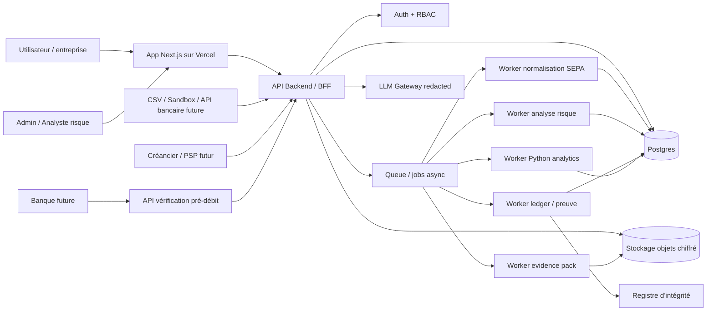
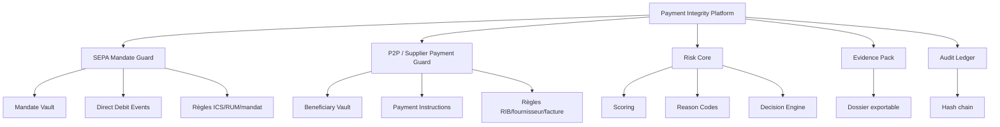
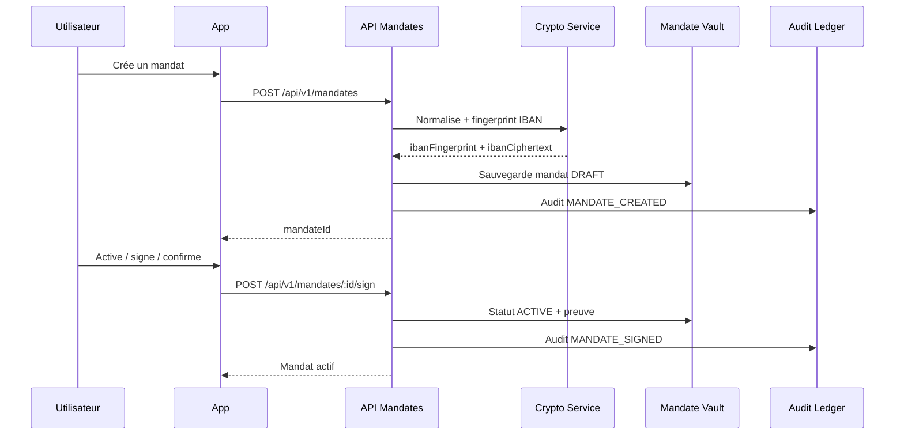
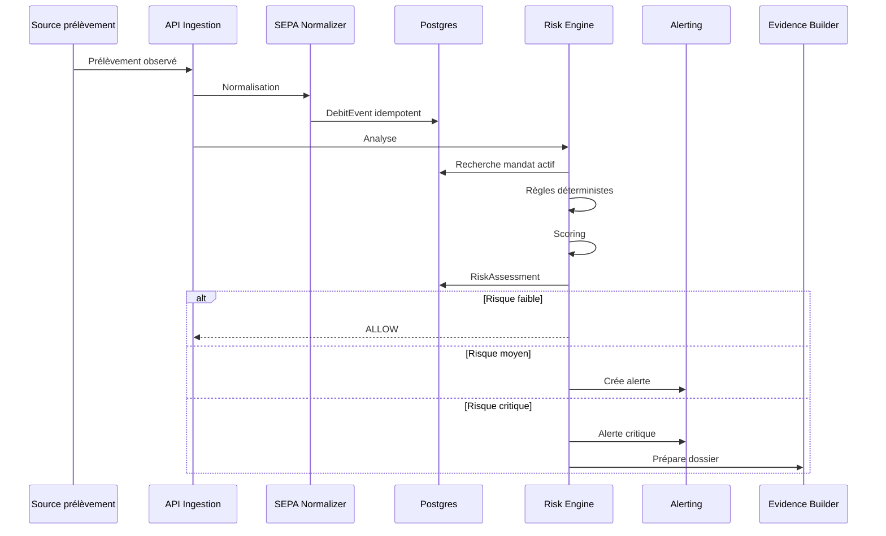
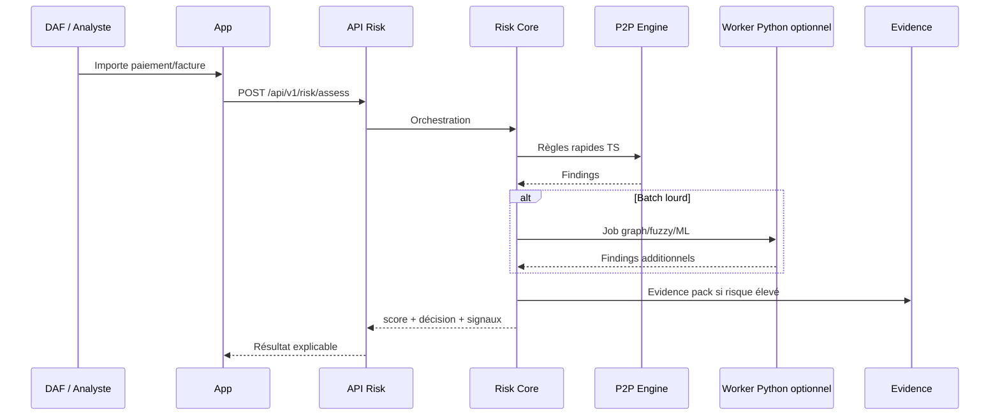
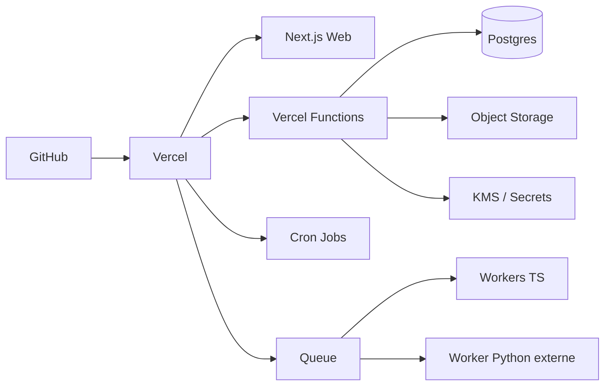

# 02 — Architecture visuelle

## Vue macro

## Plateforme à deux rails

## Flux de création d’un mandat

## Flux d’analyse d’un prélèvement

## Flux d’analyse P2P / fournisseur

## Déploiement

